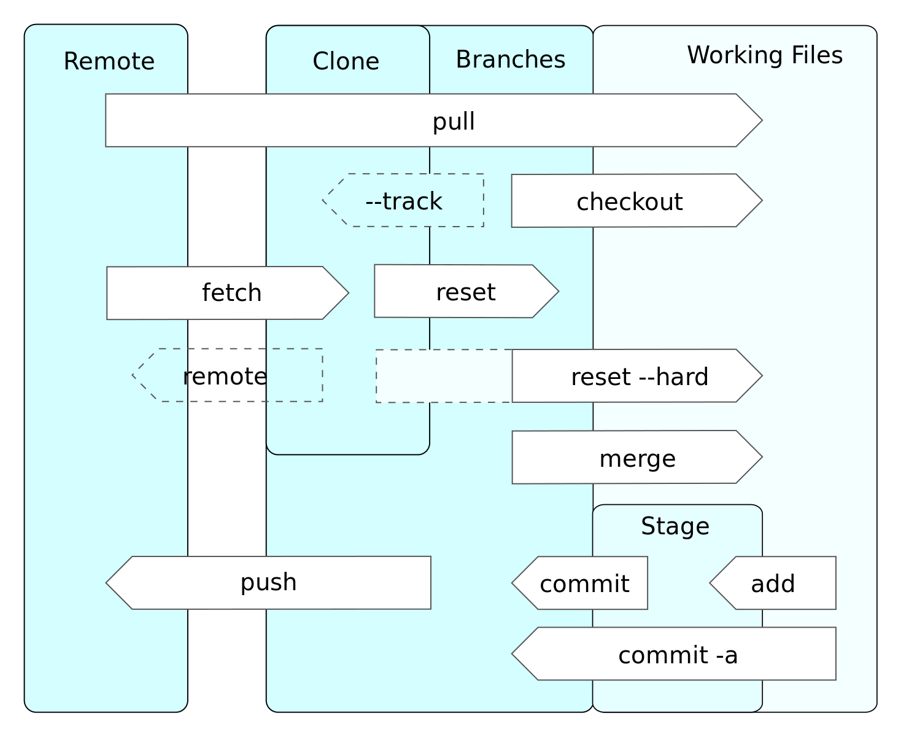

ok
[ ok ](https://commons.wikimedia.org/wiki/File:Git_operations.svg#metadata)
ok

Do you use the command line?
Do you use git from the command line?
Do you use git from a graphical tool
# Short Introduction Git
How long have you used git?
# Git basics
which of the following command du you know?
	add, rm, status, logg, commit, push, pull
# Git basics - Stageing
which of the following command du you know?
    add, rm, commit, revert, reset
# Git basics - directory
# Git basic - history
which of the following command du you know?
    log, show, reflog
# Workflows
what git workflows do you know of?
# Tags - Release
    have you ever taged a commit?
# note
# Working with Branches and remotes
what long running branches do you use?
what kinds of temporary branches do you use?
# Nested repos - overview
which of the following command du you know?
    submodules,  subtree
# Undoing Things

# Debugging
which of the following git command du you know?
    rebase,  bisect
# Config
which configuration commands have you used?
    config, config --global,  gitignore, gitattributes, hooks
# Gerrit
have you used gerrit?
# Graphics
which graphical git tools have you used?
	gitk, gitk, tortouisGit, git gui, your ide(eclipse, emacs, idea, netbeans ...)
# other
what other git commands do you use?
what other git tools do you use?

