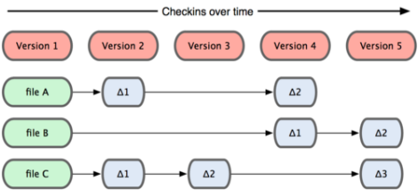
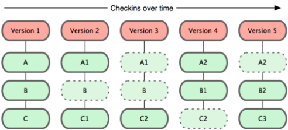
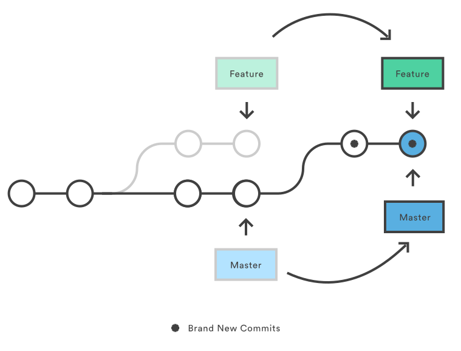
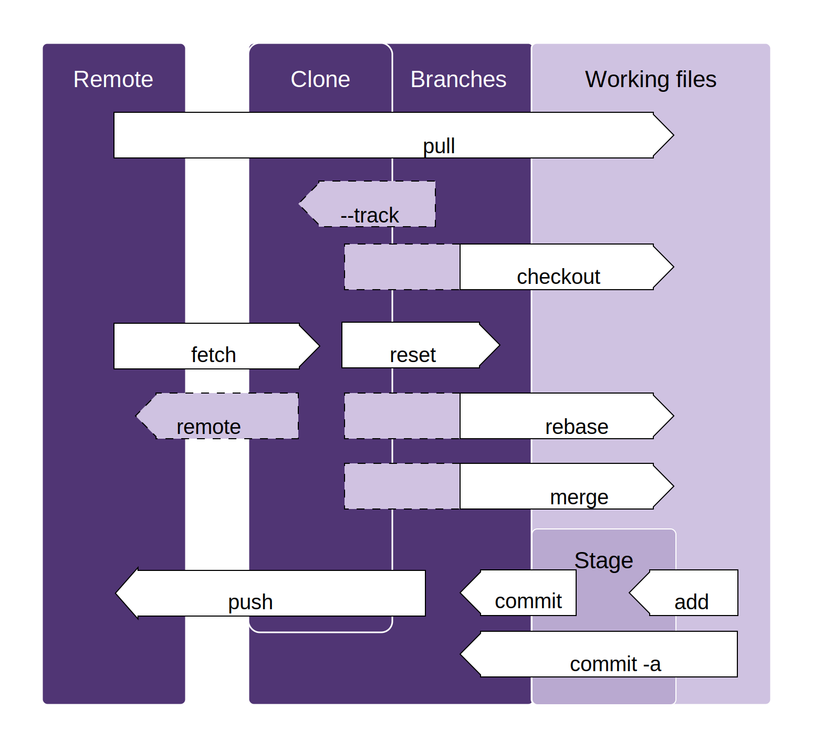
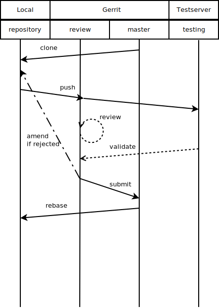
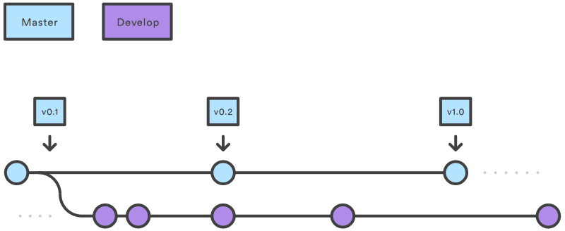
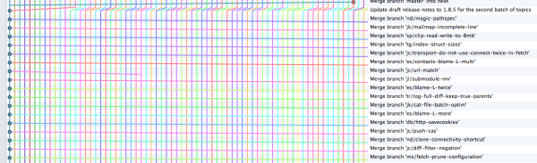
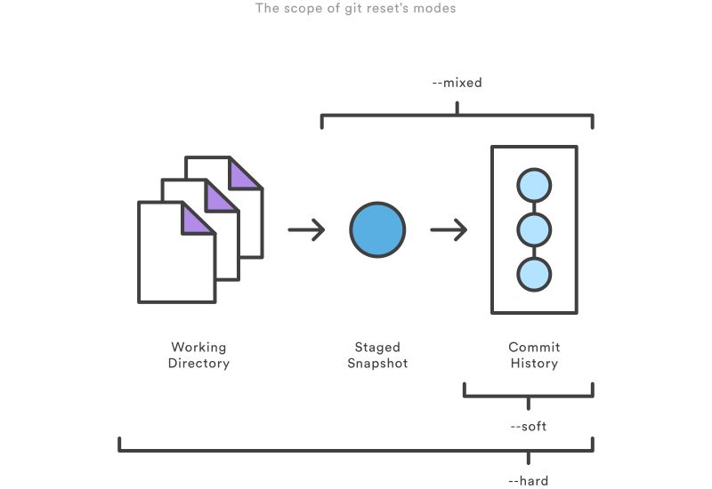
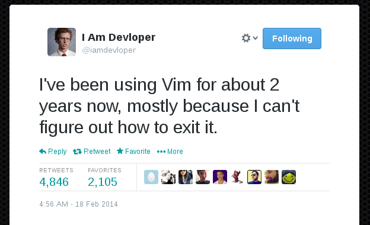

class: center

# Git training - 2 days  
### Basic and then some advanced!
##Patrik Gustafsson
Purple Scout AB

http://www.purplescout.se/project/patrik-gustafsson/

---

background-image: url(../res/ps-slide.png)

.fotnote[&copy; 2015 - Patrik Gustafsson, Purple Scout AB]
---

# Why are you here?
To raise your awareness of
 * git commands
 * git do's and don'ts
 * git workflows
 * some git mechanics
---

# Why am I here?

Years of experience as a teacher and as a developer.
Been using git professionally since 2012. 
Dabbled with it before that.
Knows dark pathways through git.
To guide you towards the light.
---

# Who am I?

Patrik Gustafsson:
* Senior Software Shaman
* Tool master
* Public speaker

Works as 
* Developer
* Git trainer

University studies:
* Master of Software Development and Education.

https://www.linkedin.com/in/paven
http://www.purplescout.se/project/patrik-gustafsson/
https://github.com/paven/birGit

---

# Short Introduction Git
* Distributed
* Fast
* Commit centered
* SHA everything
* Filesystem storage

???
<!--_Introduction to Git (Nice to have)_-->

---
often: Often
## Distributed

* The repository is local
* There are multiple repositories
* {{often}} there is a shared remote
* If the remote is down.. You can still work
--
often: ~~Often~~

---
## Distributed
[](https://en.wikipedia.org/wiki/File:Centralised-decentralised-distributed.png)
---

## Fast/ Commit Centerd
[](https://blog.xceptance.com/2013/10/01/git-the-incomplete-introduction-a-tutorial/#more-1314)

---

### Fast Commit Centerd
[](https://blog.xceptance.com/2013/10/01/git-the-incomplete-introduction-a-tutorial/#more-1314)

---

name:masterAndOrigin
title:Master and origin
# {{title}}
master(branch):
```bash
git init
git branch -v
```
origin(remote):
```bash
git clone https://github.com/paven/birGit.git
git remote -v
git branch -av
```
---
count: three
# The {{count}} phases

1. Edit - Workingdirectory
1. Add - index
1. Commit - repository history
--
name: phases
count: ~~three~~
1. Push - the remote
---
## Edit - the working directory

* The working directory is just like any other directory on you hard drive.
* contains your files
* contains .git
* edit as you like
* edited file are tagged __new/modified__ by git status

???
_Working Directory (Mandatory)_

---
## Add - to index - staged

```bash
git add theFileYouWannaAdd
git add -p theFileYouWannaAdd
```

* Creates new blobs(ie stores file content in .git)
* updates the index
* edited file are tagged __staged__ by git status
* -p allows you to select hunks of code to add from the file(s)

???

_The Index (Mandatory)_
_Interactive Staging (Mandatory)_


---
## Commit - to repository history
```bash
git commit -m "commit message"
```
* creates new trees (ie stores the directory in .git)
* creates new commit(ie stores the commit in .git)
* updates HEAD, branch
* removes from index

<!--_Recording Changes to the Repository (Mandatory)_-->
---
## HEAD

pointer to:
* latest of the series(branch?) of commits you are looking at.
* the commit, that the index and working directory is compared to.

HEAD is where your head is!

---
## Commit - the commit

```bash
git cat-file commit HEAD

```
--

* tree - SHA1
* parent - SHA1
* author
* committer
* message

---
## Commit - SHA1

```bash
(printf "commit %s\0" $(git cat-file commit HEAD |
wc -c);
git cat-file commit HEAD) |
sha1sum
```
<!--_Authors and Committers (Mandatory)_-->
---
## Directed acyclic graph (DAG)

[](http://git-scm.com/book/en/v2/Git-Branching-Basic-Branching-and-Merging)

---
# Whats happening?
* log
* show
* diff
* status

---
## Log - history

```bash
git log
git log --oneline --graph
```
---

## Show - history

```bash
git show
git show --name-only
```
---

## Diff - to history

```bash
git diff
git diff --name-only
```
???
lol
---

## Status - what is in progress

```bash
git status
```

---
# A quick look under the hood
```bash
ls -1 .git
```
```bash
branches
config
HEAD
FETCH_HEAD
ORIG_HEAD
hooks
objects
refs
logs
index
```
<!--_Git Repository (Mandatory)_-->
<!--_Git Objects (Nice to have)_-->
<!--_The Git Directory (Nice to have)_-->
---

# Exercise 1

[](http://xkcd.com/1597/)

---
template: masterAndOrigin
title:Just a friendly reminder     
name:friendly

 HEAD:

    HEAD is where your head is!

---
# Release tag

* A Tag points to a commit.
* Tags are used to mark releases.  
	* If you are doing continuous delivery, only major releases get tags
* They are tagged with a release name/number.  
	* ie "v1.2"" or "juno".
	* "v1.2-fix-1"" or "juno-fix-1"" or "v1.2.1"

--


* Can be signed.
* Can have a message.
* Tags are not pushed automatically
* Shared tags should __never__ change.

<!-- _Aggregating commits (Mandatory)_ -->
---
name: tag
	
## Release tag

lightweight tag
```bash
git tag v0.1
```

annotated Tags
```bash
git tag v0.1 -m "description...."
```

signed tag (gpg setup needed)
```bash
git tag -s v0.1 -m "description...."
```

???
can be signed -
https://git-scm.com/book/en/v2/Git-Tools-Signing-Your-Work

_Using Tag description for major release summarizing changes (Nice to have)_
<!--_Switching between releases (Mandatory)_ 
_Tagging (Mandatory)_
_Using Tags for releases (Mandatory)_
_Major releases (Mandatory)_
-->

---
## Release tag
	
list tags
```bash
git tag
```

share and receive tags 
```bash
git push --tags
git fetch
```
???

(maybe)_Using Repository History to create Change Log (Nice to have)_
---

# Exercise 2

[](https://xkcd.com/1296/)

---
# Workflows
* Forking Workflow
* Centralized Workflow
* Rebase Workflow
* Gerrit Workflow
* When to branch
* Git flow (or not)

---

## Workflow - Branches
* Feature branches
* Development branch
* Release branches
* Maintenance branches
???

covered in git flow

--

----
* keep it simple

???
hands on later
<!--_Branching Workflows (Mandatory)_-->
---
## Tags, branches, head

* tag is permanent
* branches change
* head is where your head is.
  * detached head is just a head.

they are all just pointers to a commit
---

## Forking workflow
[](https://www.atlassian.com/git/tutorials/comparing-workflows/forking-workflow)

---
## Centralized Workflow
[](https://www.atlassian.com/git/tutorials/comparing-workflows/centralized-workflow)

---
name: rebaseWF
## Rebase workflow
[](https://www.atlassian.com/git/tutorials/rewriting-history/git-rebase "CC-BY-SA Nanna Naumann based on work by Atlassian")

---
name:gitCommands
[](https://commons.wikimedia.org/wiki/File:Git_operations.svg "Nanna Naumann")
---
## Gerrit workflow

* local [(1,2,3)](#phases)
* review [(almost 4)](#phases)
* master [(4)](#phases)

---

.center[]

---
## When to branch
__+__ Branches are basically a free resource!  
__+__ Allows you to save state of a task!  
__+__ Allows you to track forks!  
__+__ Allows you to share incomplete work

 
--

__±__ Branches containing discarded commits will keep them in the repository.  

--
name: whenToBranch

__-__ HEAD keeps track of what you are doing!  
__-__ Unused branches clutters the branch list!  
__-__ When are you going back to that branch?  
__-__ Is there an other way to find that commit?  
 
???
--_Branch Management (Mandatory)_--
---
## Git Flow

* local [(1,2,3)](#phases)
* feature-* [(4?)](#phases)
* develop [(4)](#phases)
* release-* [(4!)](#phases)
* hotfix-* [(4)](#phases)
* master [(4!!)](#phases)

1. everything gets a branch  
1. has a cool plugin

.fotnote[https://github.com/nvie/gitflow]

---

### Git Flow

[](https://www.atlassian.com/git/tutorials/comparing-workflows/gitflow-workflow "CC-BY Atlassian")

---

### Feature branch
[](https://www.atlassian.com/git/tutorials/comparing-workflows/centralized-workflow "CC-BY Atlassian")

---
template: whenToBranch
---
### Development branch

[](https://www.atlassian.com/git/tutorials/comparing-workflows/gitflow-workflow "CC-BY Atlassian")


---
### Release branch

[](https://www.atlassian.com/git/tutorials/comparing-workflows/gitflow-workflow "CC-BY Atlassian")

???
!--_Release branch (Mandatory)_--
---

### Release branch

* release-&#42;
* release-v12.1.2
* [tag](#tag) v12.1.2

---
### Maintenance branch

[](https://www.atlassian.com/git/tutorials/comparing-workflows/gitflow-workflow "CC-BY Atlassian")

---

### Maintenance branch

* hotfix-*

<!--_Managing maintenance release (Mandatory)_ ?-->
---

# Exercise 3

---

# Working with Branches

* Branch
* checkout
* Rebase
* Merge
* Prune

???
_Branch Management (Mandatory)_
---
template: friendly
---
## Branch

create
```bash
git branch branchName
```

list
```bash
git branch
git branch -v
git branch --merged
git branch --no-merged
```
---
## Branch 
delete a branch(safe)
```bash
git branch -d branchName
```
to remove a branch with unmerged commits(unsafe)
```bash
git branch -D branchName
```
???
_Branching and Merging (Mandatory)_
---
name: commitish
## Commitish

    <sha1>, e.g. dae86e1950b1277e545cee180551750029cfe735, dae86e
    <describeOutput>, e.g. v1.7.4.2-679-g3bee7fb
    <refname>, e.g. master, heads/master, refs/heads/master,
    ... HEAD, FETCH_HEAD, ORIG_HEAD, MERGE_HEAD,CHERRY_PICK_HEAD

--

    <refname>@{<date>}, e.g. master@{yesterday}, HEAD@{5 minutes ago}
    <refname>@{<n>}, e.g. master@{1} (previous heads)
    @, @{<n>} implies head
    @{-<n>} means the <n>th branch/commit checked out before the current one.
    <refname>@{upstream}
    /<text>
--
name: commitish

    <rev>^, <rev>~<n>, <rev>^{<type>}, <rev>^{}, <rev>^{/<text>}
<!--The commit-ish-->
---

## Checkout

Checkout a branch/tag/commit
```bash
git checkout <commitish>
```

Checkout a branch/tag/commit and create a branch new branch
```bash
git checkout -b <newBranch> <commitish>
```

---
template: rebaseWF
---
## Rebase

Start from a branch/commit and add your commits on top of it.
```bash
git rebase master yourBranch
```
then update master branch with your branch (after it has been rebased)
```bash
git rebase yourBranch master
```


???
_Rebasing (Mandatory)_
_Aggregating smaller changes into bigger one (closer to the business) (Mandatory)_
_Grouping commits into logical parts (Mandatory)_
_Keeping Central repository clean (Mandatory)_
---
## Rebase - Golden rule

* Do not change a shared history...

???
_Rewriting History (Mandatory)_

---
template: gitCommands

---

# Exercise 4

[](http://xkcd.com/562/)

---

## patrik.gustafsson@purplescout.se

---
# Merge

[](https://www.atlassian.com/git/articles/git-team-workflows-merge-or-rebase)


???
z linux 
b log -n100
---

# Merge

```bash
checkout master
git merge  <commitish>
```

--

alternative rebase workflow
```bash
git rebase master
checkout master
git merge --ff-only <commitish>
```
---

# Excercise 5


[](https://pixabay.com/sv/sammanslagning-trafik-tecken-v%C3%A4g-39400/)

---

# Remotes 
clone
```bash
git clone <url>
```
add

```bash
git remote add <remotename> <url>
```
set
```bash
git remote set-url <remotename> <url>
```

???
* Remotes:
Github
_Distributed repositories (Mandatory)_
_Working with Remotes (Mandatory)_
_Hosted Git ~~(CollabNet TeamForge) (Mandatory)~~_

---

## Remote branches

```bash
git branch -a
git branch  -a --merged=origin/master
git branch --no-merged=origin/master
```
--
push to a remote branch
```bash
git push origin HEAD:branchToUpdate
```

delete a remote branch
```bash
git push :branchToDeletete
```

???
_Remote Branches (Mandatory)_

---
## Remote download

```bash
git fetch
```

fetch and merge/rebase
```bash
* pull (--rebase)
```
---

## Spring cleaning

clear out local clones of remote branches
```bash
git remote prune origin (--dry-run)
```

do that while fetching
```bash
git fetch -p
```
???
_Branch Management (Mandatory)_

---

## Rebase workflow

```bash
git fetch
git checkout origin/master
```
Do work...
```bash
git fetch
git rebase origin/master
git push origin HEAD:master
```
---
## Rebase workflow
```bash
git fetch
git checkout -b issue origin/master
```
Do Work...
```bash
git pull --rebase
git push origin HEAD:master
git branch -d issue
```
---

## Rebase conflict
   
    First, rewinding head to replay your work on top of it...
    Applying: Conflicting commit
    Using index info to reconstruct a base tree...
    M	firstFile.txt
    Falling back to patching base and 3-way merge...
    Auto-merging firstFile.txt
    CONFLICT (content): Merge conflict in firstFile.txt
    Recorded preimage for 'firstFile.txt'
    Failed to merge in the changes.
    Patch failed at 0001 Conflicting commit
    The copy of the patch that failed is found in:
       /home/pvn/git/git2-exercise/.git/rebase-apply/patch
    
    When you have resolved this problem, run "git rebase --continue".
    If you prefer to skip this patch, run "git rebase --skip" instead.
    To check out the original branch and stop rebasing, run "git rebase --abort".
    
---

## Merge Conflict

    Auto-merging firstFolder/secondtFile.txt
    CONFLICT (content): Merge conflict in firstFolder/secondtFile.txt
    Recorded preimage for 'firstFolder/secondtFile.txt'
    Automatic merge failed; fix conflicts and then commit the result.

not as informativ/ less cluttered than the rebase messege
```bash
merge --abort
```
---

## Reviewing the conflict
```bash
git status
cat conflictingFile.txt
```
---
## Merge/Rebase conflicts

    some code that is in both
    <<<<<<< HEAD
    this is from head
    =======
    this is from the commit adding to it
    >>>>>>> conflictingCommit
	more code that is in both

---
# Excercise 6 

[](http://angriestprogrammer.com/comic/source_control)
https://github.com/paven/git2-exercise

???
tell them to look att the README instead of the cheat

---
# Nested repos - overview

* Submodules
* Subtrees
* alternatives

---

## Submodule

Feature | Submodule | Subtree
--|--|--
part of git | yes | yes
meta data of main repo | no | yes
config part of main repo | yes | no

---
## Submodule

add an existing repo/branch as a submodule
```bash
git submodule add -b submoduleBranch https://git..xercise  module
```
meta information in repo
```bash
cat .gitmodules
ls .git/modules/
```
update an existing submodule
```bash
git submodule update -init
```

clone with submodules
```bash
git clone --recursive https://github.com/chaconinc/MainProject
```

???
_Submodules (Mandatory)_
git tracks what version a submodule has.

---
## Subtree merging

easy to split out a new subtree
```bash
git subtree split --prefix=path/to/code -b newSubtreeBranch
```
merge in a subtree
```bash
git subtree add --prefix=path/to/code --squash shared master
```

???
git tracks the files and commits in the repository as "normal commits"
_Subtree Merging (Mandatory)_
---
## Alternative

* don't blend repos!
* use a proper build tool!

but useful for:

* subtree - useful if you meant to extract a library
* both - if you are not using a build tool(ie webpage)

???
_How to divide logically application and the repository (Nice to have)_

---

## Exercise 7 

---
# Undoing Things

* stash
* clean
* reset
* checkout
* commit --amend
* rebase -i
* revert
* push -f


???
_Undoing Things (Mandatory)_
_Revision Selection (Mandatory)_
---
## Stash

moves away your working directory changes, including indexed to a stash
```bash
git stash
```
stashes can be listen
```bash
git stash list
```
the stash can be added back
```bash
git stash pop <stash>
git stash apply <stash>
```

---
## Clean
```bash
git clean -ind	
```
* i - interactive
* n - dry run
* d - directories 
* f - force 
---
## Reset

[](https://www.atlassian.com/git/tutorials/resetting-checking-out-and-reverting/commit-level-operations)

---
## Reset
just move the branch pointer
```bash
git reset --soft <commitish>
```
also set the index to match the head
```bash
git reset --mixed <commitish>
```
also set the working directory to match the index
```bash
git reset --hard <commitish>
```
---
## Checkout
* moves head and updates working directory
```bash
git checkout origin/master
git checkout HEAD^
git checkout <commitish>
```
---
## - just a file

reset gets the file and adds it to the index(and WD)
```bash
git reset <commitish> file.txt
```

checkout adds it only to the working directory
```bash
git checkout <commitish> file.txt
```
---

## Revert

* do not change history
* creates an new commit that reverts the old one

```bash
git revert <commitish>
```
---

## commit --amend

Changes the last commit (the one that head points to).

```bash
git commit --amend
```

---
## rebase interactive

lets you change/reorder/drop commits interactively 
```bash
git rebase -i origin/master
```
---

## push -f
 
if you have to break your


# Debugging

* rebase
* bisect
_Debugging with Git (bisect) (Mandatory)_
---
## rebase

to run a script on multiple historic commit
```bash
git rebase -i --exec "test.sh"
```
---
## bisect

to run a script like a binary search 
```bash
git bisect start <bad> <good>
git bisect run "test.sh"
```
manual bisect
```bash
git bisect start <bad> <good> 
..
git bisect good
git bisect bad
git bisect skip
```
---
# Config

* .git/config
* ~/.gitconfig
* .gitignore
* .gitattributes
* .git/hooks

---
## Config repository


```bash
git config -e
.git/config
```

change behavior of commands. 
```bash
git config merge.ff only
```
for specific branches
```bash
git config branch.*branch-name*.rebase true
git config branch.autosetuprebase always

```
???
 _Git Configuration (Nice to have)_ 
---
## config --global ie your computer
```bash
git config --global -e
~/.gitconfig
```

```bash
git config --global pull.rebase true
```
---
## Config Ignore

```bash
git config --global core.excludesfile ~/.gitignore_global
~/.git/info/exclude
.gitignore
```

  .idea  
  .trash  
  &#42;.md  
  /hidden/&#42;  
???
_Ignores and Excludes (Mandatory)_

### check ignore

why is an file ignored
```bash
git check-ignore path -v
```
important since multple ignore files can hide stuff.

---
## Config attributes

```bash
.gitattribute
.git/info/attributes
.config/git/attributes
```
* Checking-out and checking-in
* Generating diff text(for bin files)
* Defining pattern as binary file
* End-of-line conversion

---
## Hooks

```bash
~/.git/hooks/
~/.git/hooks/pre-commit
```

shall be executable by the operating system

???
<!-- _Git Hooks (Nice to have)_ -->
---

# Exercise 8

[](https://twitter.com/iamdevloper/status/435555976687923200)

---
# Gerrit
* Code review: 

* Verified:

???
_Code reviews (Gerrit) (Mandatory)_
_Creating structure for aggregating and reviewing changes from developers (Mandatory)_
_Testing and Staging environment (Nice to have)_

---
# Gerrit push
```bash
git push HEAD:refs/publish/master
git push HEAD:refs/for/master

```
---
# Gerrit Example

https://review.gerrithub.io/#/dashboard/self

---
# git review

https://www.mediawiki.org/wiki/Gerrit/git-review

---
# GUI
* your IDE (ex IDEA)
* gitk
* git gui
alternatives: like tortoisegit, SmartGitHg

???
_Git Commands Git via GUI (GIT Extensions or similar) (Mandatory)_

---
# now what

* man git-*
* https://www.atlassian.com/git/tutorials/
* https://git-scm.com/

## more from the teacher
* https://github.com/paven/.config/blob/master/.gitconfig 
* https://github.com/paven/birGit
* https://www.linkedin.com/in/paven
* https://plus.google.com/+PatrikGustafsson
* https://twitter.com/paven
---
# Appendix:


---
template: friendly
---
template: commitish

https://www.kernel.org/pub/software/scm/git/docs/gitrevisions.html#_specifying_revisions

---
# Treeish

	<commitish>

name: treeish

	<sha1> e.g. aede5c3281282f41df760a28209eeb932fb0a267
	<rev>:<path>, eg HEAD:src, :src, master:./src

<!--_The Treeish (Nice to have)_-->

# Blobish

	<sha1> e.g. e69de29bb2d1d6434b8b29ae775ad8c2e48c5391
	<rev>:<path>, e.g. HEAD:README, :README, master:./README


---
# Fixes and so on

http://stackoverflow.com/questions/2835775/msysgit-bash-is-horrendously-slow-in-windows-7

---


   
